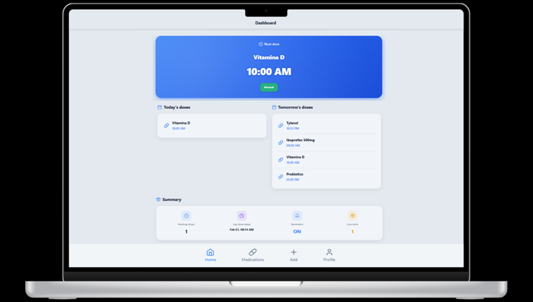
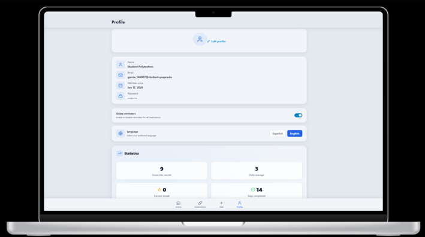

# Medicine Tracker & Care Assistant

A responsive medication management web app designed to help patients track medications, schedules, refills, and daily doses through a user-friendly interface.

## Overview

Medicine Tracker & Care Assistant was developed as my Computer Science capstone project. The goal was to create a patient-centered platform where users can register medications, manage schedules, track upcoming doses, and support better medication adherence.

## My Role

I worked on the frontend development and quality assurance side of the project. My responsibilities included building user-facing screens, improving mobile usability, testing workflows, and making sure the app was clear and accessible for patients.

## Features

- User registration and login
- Dashboard with today’s medications and upcoming doses
- Medication list and add/edit medication forms
- Schedule management
- Profile and settings pages
- Statistics page for medication tracking
- Mobile-friendly navigation

## Tech Stack

- React
- JavaScript
- React Router
- Tailwind CSS
- Component-based UI design

## Screenshots

### Dashboard

### Medication List

### Add Medication

### Schedule Page

### Settings

## What I Learned

This project strengthened my ability to build frontend applications with reusable components, organize navigation flows, test user interactions, and think about software from the perspective of real users who need simple and reliable tools.

## Future Improvements

- Connect the frontend to the backend API
- Add caregiver view
- Improve medication adherence analytics
- Add reminder notifications
- Improve accessibility testing

## Author

Rosaliz V. García  
Computer Science graduate with a concentration in Data Science  
GitHub: cybereptilia
